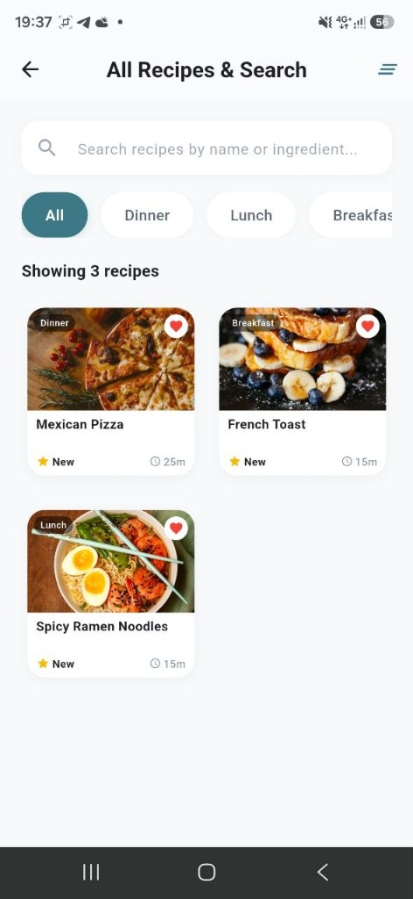
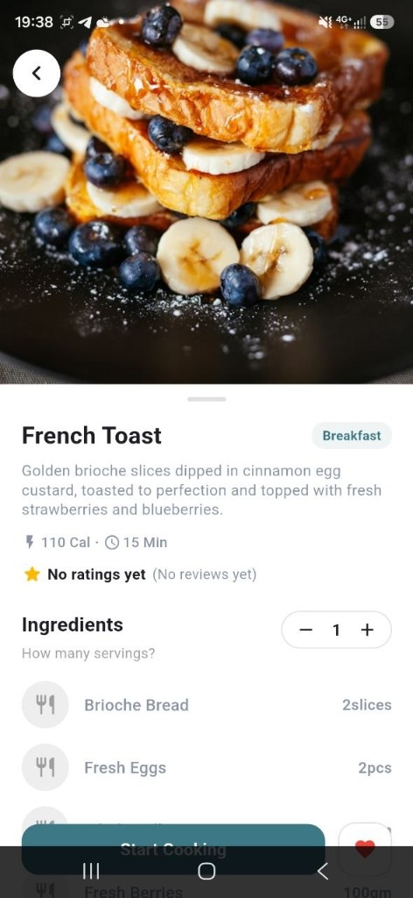
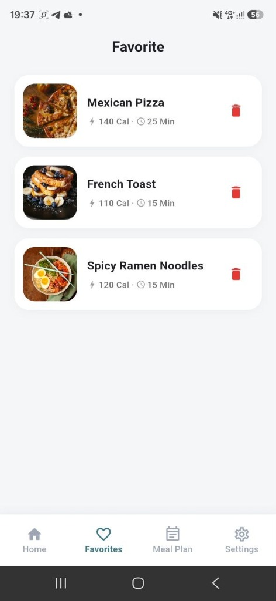
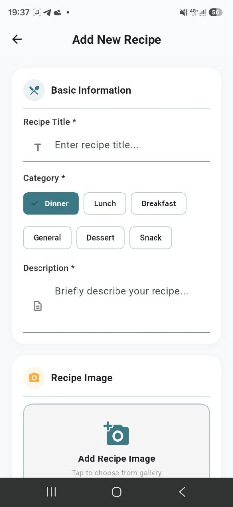

# 🍳 Recipe App — Modern Flutter & Firebase Cooking Companion

A beautifully crafted, modern **Flutter Recipe Application** built with **Firebase Authentication**, **Cloud Firestore**, and **Provider State Management**. The app provides culinary enthusiasts with an intuitive experience to discover, search, filter, scale ingredients, leave real-time reviews, save persistent favorites, and create custom recipes.

---

## 📸 Screenshots Showcase

<p align="center">
  
  
  
  
  
</p>

---

## ✨ Key Features

### 🔐 1. Firebase Authentication & Profile
- **Secure Authentication**: Email & Password registration and login via Firebase Auth.
- **User Profiles**: Live Firestore user profile creation and management (`users/{uid}`).
- **Persistent State**: Maintains user authentication across application restarts.

### 🏠 2. Dynamic Home & Discovery Dashboard
- **Promotional Banner**: Highlighting featured cooking recipes with clean CTA buttons.
- **Category Chips**: Quick category navigation (`All`, `Breakfast`, `Lunch`, `Dinner`, `Dessert`, `Snack`).
- **Single-Row Horizontal Carousel**: Compact, elegant recipe cards for featured and quick & easy dishes.

### 🔍 3. Real-Time Search & Multi-Level Filtering
- **Dynamic Search**: Instant case-insensitive filtering by recipe name or ingredients.
- **Category Filter**: Filter recipes dynamically by meal type.
- **Combined Search + Filter**: Seamlessly search while preserving category selection across responsive 2-column grid views.

### 📖 4. Interactive Recipe Details & Ingredient Scaler
- **Serving Quantity Adjuster**: Interactive `- 1 +` buttons that dynamically calculate scaled ingredient quantities in real-time.
- **Detailed Instructions**: Clean step-by-step preparation and cooking guides.
- **Real Review & Rating System**: Live Firestore reviews subcollection (`recipes/{recipeId}/reviews`) with automatic average rating calculations. Zero hardcoded/fake reviews.

### 💖 5. Persistent Favorites Management
- **Firestore Persistence**: User favorites synced live to Cloud Firestore (`users/{uid}` -> `favoriteIds`), ensuring saved recipes persist across logins and devices.
- **Single-Column Clean List**: Clean white card UI with calorie/prep time indicators and 1-tap delete with interactive `Undo` SnackBar notifications.

### 📝 6. Recipe Management (CRUD)
- **Add & Edit Recipes**: Structured 5-section form (*Basic Info*, *Recipe Image*, *Cooking Info*, *Ingredients*, *Instructions*).
- **Gallery Image Picker**: Device gallery picking via `image_picker` with Base64 encoding for instant cross-platform image rendering.
- **Dynamic Ingredient Builder**: Add or remove ingredients with custom names, amounts, and units.

---

## 🛠️ Tech Stack & Architecture

| Layer | Technology |
| :--- | :--- |
| **Framework** | [Flutter](https://flutter.dev/) (Dart) |
| **State Management** | [Provider](https://pub.dev/packages/provider) (`ChangeNotifier`) |
| **Backend & Database** | [Firebase Auth](https://firebase.google.com/docs/auth) & [Cloud Firestore](https://firebase.google.com/docs/firestore) |
| **Image Handling** | [image_picker](https://pub.dev/packages/image_picker) & Base64 Data URLs |
| **Architecture** | Repository Pattern (`Services` ➔ `Repositories` ➔ `Providers` ➔ `UI Screens`) |

### 📂 Directory Structure

```text
lib/
├── app/                  # App configuration, routes, & theme definitions
│   ├── routes.dart
│   └── theme.dart
├── models/               # Data models with fromMap/toMap serialization
│   ├── ingredient_model.dart
│   ├── recipe_model.dart
│   ├── review_model.dart
│   └── user_model.dart
├── providers/            # State management providers
│   ├── auth_provider.dart
│   └── recipe_provider.dart
├── repositories/         # Data abstraction layer
│   ├── auth_repository.dart
│   └── recipe_repository.dart
├── screens/              # App UI screens by feature
│   ├── auth/             # Login & Registration screens
│   ├── explore/          # Explore recipes screen
│   ├── favorites/        # Favorites management screen
│   ├── home/             # Main Home screen & Tab navigation
│   ├── profile/          # User profile screen
│   ├── recipe/           # Add/Edit & Recipe details screens
│   └── search/           # All recipes & search screen
├── services/             # Firebase Auth & Firestore service APIs
│   ├── auth_service.dart
│   └── firestore_service.dart
├── utils/                # Constants, helpers, & validators
└── widgets/              # Reusable UI widgets (RecipeCard, CategoryCard, etc.)
```

---

## 🚀 Getting Started

### Prerequisites

- [Flutter SDK](https://docs.flutter.dev/get-started/install) (v3.0.0 or higher)
- [Dart SDK](https://dart.dev/get-dart)
- An active [Firebase Project](https://console.firebase.google.com/) configured for Android/iOS/Web.

### Installation

1. **Clone the Repository**:
   ```bash
   git clone https://github.com/Rayhan22CSE/-Recipe-App.git
   cd -Recipe-App/flutter_recipe
   ```

2. **Install Dependencies**:
   ```bash
   flutter pub get
   ```

3. **Configure Firebase**:
   Ensure `google-services.json` (for Android) or `GoogleService-Info.plist` (for iOS) is configured in your project directories, or use `firebase_options.dart`.

4. **Run the Application**:
   ```bash
   flutter run
   ```

---

## 🧪 Testing & Verification

Run static analysis and automated unit/widget test suites:

```bash
# Run static analysis
flutter analyze

# Run unit and widget tests
flutter test
```

---

## 📄 License

This project is open source and available under the [MIT License](LICENSE).
